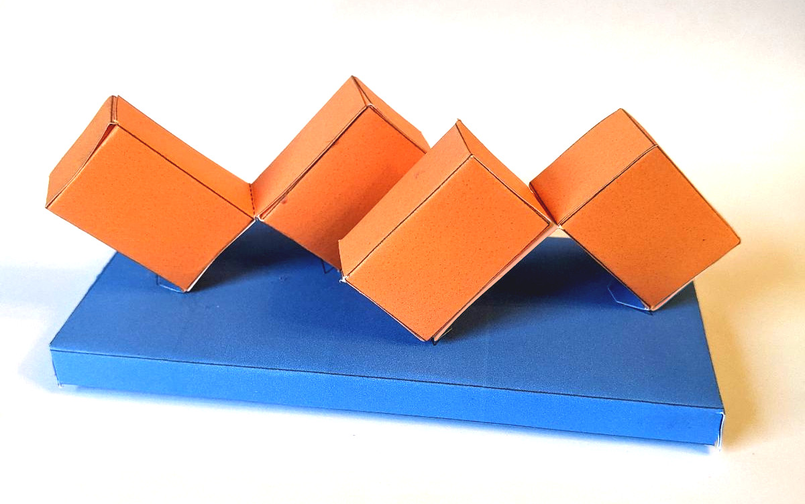
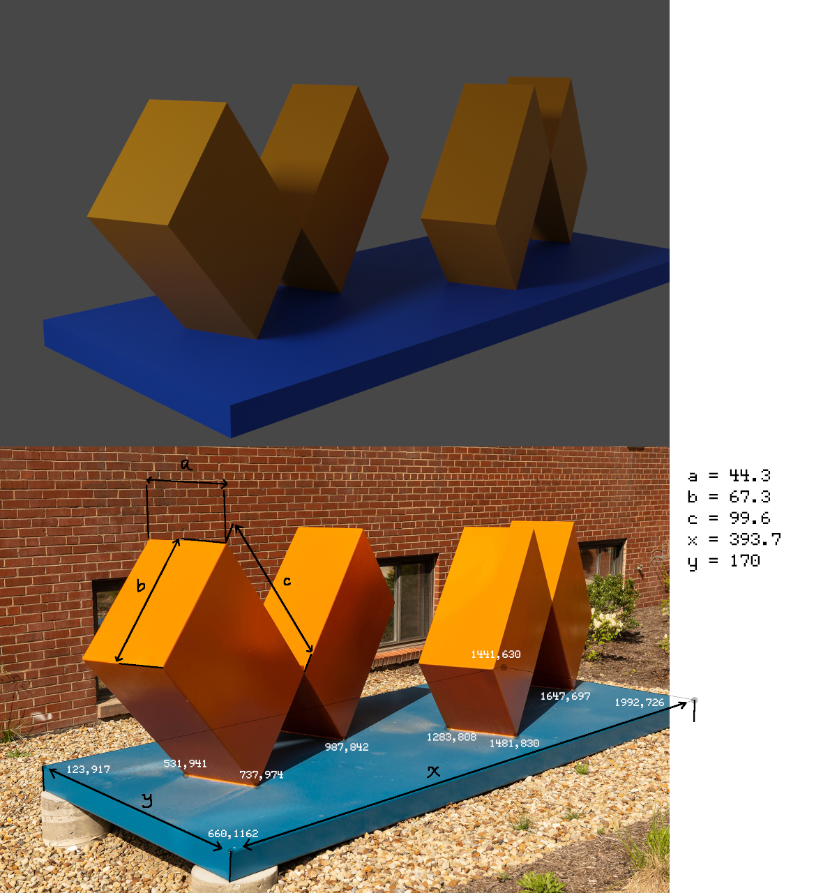

Cheeto
======

Some attempts to do photogrammetry to a picture of "The Love of Two
Oranges" I [found in an article about
it](https://www.cmu.edu/piper/news/archives/2021/june/the-love-of-two-oranges.html),
a sculpture by Clark Winter, located on the campus of Carnegie Mellon
University outside of Wean Hall for many years.






Contents
========

- `src/lib.ts`: a stub of a pdf-generation library I was using elsewhere, just the type `Point`
- `src/sage-computation.py`: some code meant to be used in sagecell
- `src/make_template.ts`: make a papercraft template

- `src/node-computation.ts`: sort of a port of sage-computation to typescript
- `src/make_usda.ts`: generate an ascii USD file suitable for import into blender
- `cheeto.blend`: a blender file with some manually added materials and a light source

- `src/sage-computation2.py`
- `src/vutil.ts`

Running
=======

```shell
npm i
make watch
# in another shell:
node out/make_usda.js # produces /tmp/cheeto.usda, suitable for import into 3d modelling software
node out/make_template.js # produces /tmp/cheeto.html, suitable for printing
```
